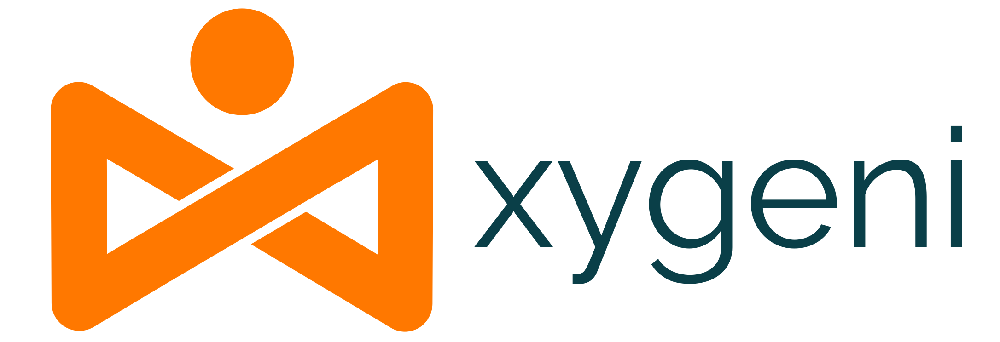
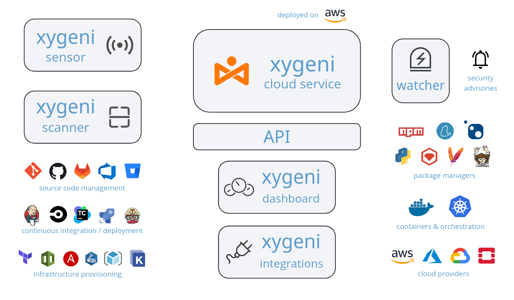

<div align="center">
  </img><br/>
  <i>End to End Software Development and Delivery Security</i>
</div>

---

[](https://docs.xygeni.io/) 
[](https://api.xygeni.io/swagger-ui.html) 
[]() 
[](https://xygeni.io/)

## Overview

Xygeni is a platform for improving the Software Supply Chain Security posture for organizations.

The platform protects the integrity and security of your software ecosystem throughout the entire DevOps

The platform features:

- **SDLC inventory**, which is automatically discovered from sources and configuration. The inventory enables us to know how assets in software infrastructure at the organization are related, for impact and risk propagation analysis: _"We can't protect what we don't know it exists."_

- **Code tampering prevention**, to protect critical code againt unintended changes done without following a strict change review process. 

- **Identify unusual activity**, anomalies in behaviour as evidence for a potential security breach, particularly when administering SDLC tools. Imagine a resource like a organization's private code repository: clones from unintended users or from anomalous geographic locations, adding-and-removing permissions in a short time period, deleting branch protection rules, or using admin rights to merge code without review or with failed status checks, are examples of such anomalies.

- **Software dependency analysis**, to control open source, proprietary and third-party components used throughout the software supply chain. This includes the discovery of components, detection of common attacks to the dependencies like typosquatting or dependency confusion, and extended SBOM management.

- **Detection of misconfigurations**, in source code managers, CI/CD pipelines and tools, build and deploy tools, artifact registries and package managers. Misconfigurations at these tools open the door to supply chain attacks, so a quick-and-easy detection capacity is necessary.   

- **Detection of Secret leaks** with optional validation that the secret is currently active and detailed instructions on how to remove / revoke the hardcoded secrets found.

- **Finding IaC flaws** in provisioning IT/Cloud templates, for the main IaC frameworks and configuration management tools. Common security flaws are reported before the assets are deployed at runtime.

- **Hardening build systems** with attestations on software provenance, chain of build steps and augmented SBOM, that could be validated and checked against deploy policies when the build artifact needs to be deployed or used by a client.

- **Compliance assessment** with common software supply chain standards and guidelines, like `Google SLSA`, `OpenSSF ScoreCard`, `CIS Software Supply Chain Security` benchmark, `OWASP Top-10 for CI/CD Security`, or the `ESF Securing SSC Guide for Developers`. Xygeni runs sort of automated audits on software projects for compliance assessment, were each standard is composed of a set of checkpoints to pass. The result tells us if the project complies with the standard, with a compliance level.

## The platform components

The platform is a cloud-based service, accessible via REST API, that keeps findings and metadata from different sources.



**Scanner**: Xygeni provides a command-line interface (CLI) for running the scanner. The scanner can either run analysis commands separately, like detecting hardcoded secrets or misconfigurations, or run all the analyses at once.

**Sensor**: For capturing _unusual activity_, a monitoring component (_Sensor_) can be installed on target systems (typically SCM or CI/CD tools) for monitoring the user actions and detecting activity that may evidence a bad practice, or even an ongoing attack. In addition, the sensor may capture access control data for detecting accounts with excessive privileges, or 'stale' accounts.

**Dashboard**: The Dashboard is the web user interface for showing the results of the scans. The dashboard provides a summary security posture and the breakdown of security issues at the global, group or project levels; plus trends exploration, reporting, and platform administration, among other facilities.

**API**: The REST API is the central element in the platform. All elements in the platform use the API as a backbone for reporting findings and receiving the processed information for integration into Xygeni tools, third-party plugins and integrations, or any custom integration for organizations.

**Integrations**: Xygeni provides ready-made integrations for running scans in CI/CD systems or uploading security issues, performing administrative operations, or exporting findings to communication and reporting tools.

**Watcher**: Activity on public registries is monitored by Xygeni so potential attacks could be detected early. Publishing new packages in popular public repositories is an example of an activity that is monitored by Xygeni. In addition, security advisories are ingressed for modelling new threats and malicious activity on the wild. Xygeni customers may receive alerts when a security issue may affect them.

## Installation

For operating with the Xygeni platform, you must have a valid user account linked to your organization at Xygeni.

> **NOTE**: Your organization must have a valid subscription with Xygeni Security. Please proceed to [how to subscribe to Xygeni](https://xygeni.io/book-a-demo) for further details.

Follow the instructions provided in the [Xygeni Quick Start](https://docs.xygeni.io/xydocs/introduction/quick_start.html) section of the documentation.

## Current checksums

* `install.sh` (install script for Linux/macOS): [checksum link](https://raw.githubusercontent.com/xygeni/xygeni/main/checksum/latest/install.sh.sha256)
https://github.com/xygeni/xygeni/blob/ec353d61e560fb031a5983ba5d57cab843833152/checksum/latest/install.sh.sha256?plain=1#L1

* `install.ps1` (install script for Windows): [checksum link](https://raw.githubusercontent.com/xygeni/xygeni/main/checksum/latest/install.ps1.sha256)
https://github.com/xygeni/xygeni/blob/036472c2e102272f82360446ab51f1e9dee876e8/checksum/latest/install.ps1.sha256?plain=1#L1

* `xygeni-release.zip` (scanner): [checksum link](https://raw.githubusercontent.com/xygeni/xygeni/main/checksum/latest/xygeni-release.zip.sha256)
https://github.com/xygeni/xygeni/blob/a010da67e80ab2359504796ada8a071eacb6689e/checksum/latest/xygeni-release.zip.sha256?plain=1#L1

* `salt.zip` (build attestations): [checksum link](https://raw.githubusercontent.com/xygeni/xygeni/main/checksum/latest/salt.zip.sha256)
https://github.com/xygeni/xygeni/blob/e393089cc73746a0dbbc9c4e8bc83e09c057e39d/checksum/latest/salt.zip.sha256?plain=1#L1

So you may verify the integrity of a downloaded artifact. For example, for install scripts:

* Under Linux / macOS:
```
# Download the install script from downloads area
curl -sLO https://get.xygeni.io/latest/scanner/install.sh

# Check the scanner checksum published in xygeni GitHub repo (separate environment)
checksum="$(curl -s https://raw.githubusercontent.com/xygeni/xygeni/main/checksum/latest/install.sh.sha256)"
echo "$checksum install.sh" | sha256sum --check
```

* Under Windows (PowerShell):
```
# Download the install script (via Invoke-WebRequest)
iwr https://get.xygeni.io/latest/scanner/install.ps1 -useb -OutFile install.ps1

# Check the scanner checksum
(Get-FileHash '.\install.ps1' -Algorithm SHA256).Hash -eq `
  (iwr https://raw.githubusercontent.com/xygeni/xygeni/main/checksum/latest/install.ps1.sha256)
```

